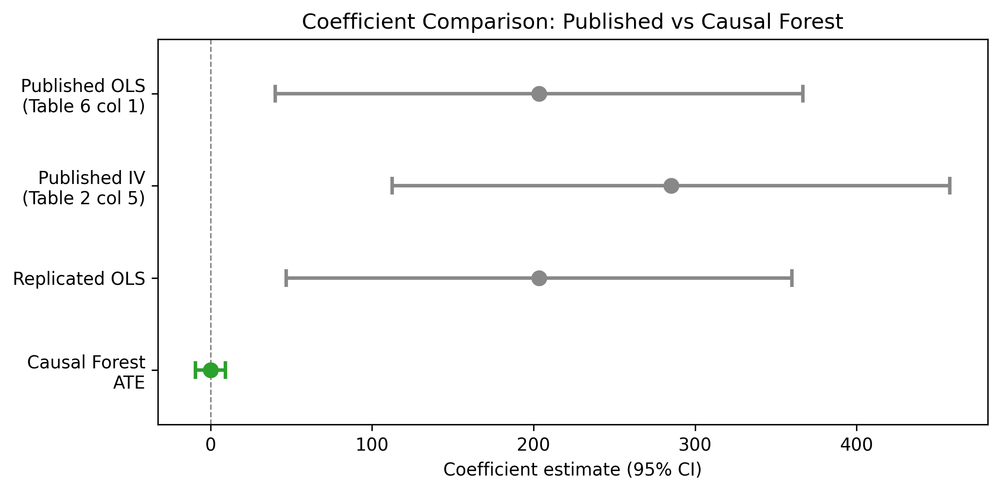
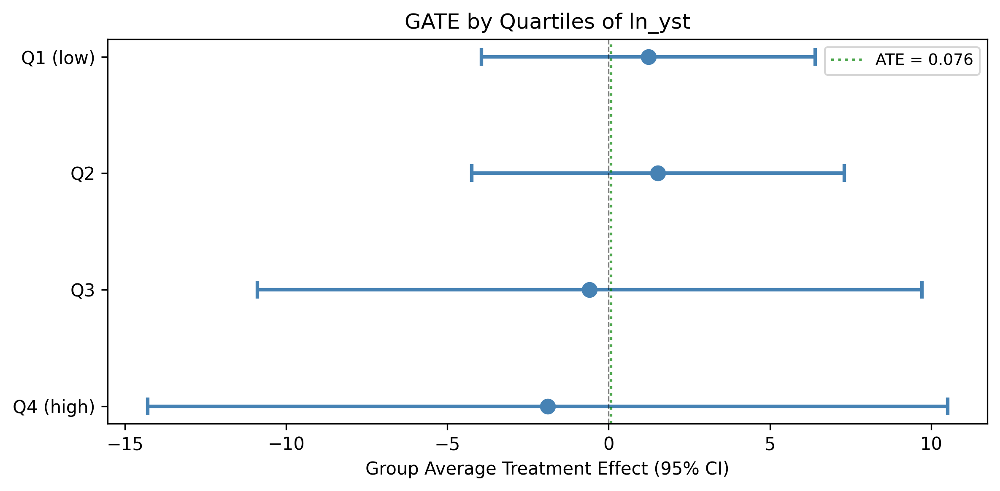
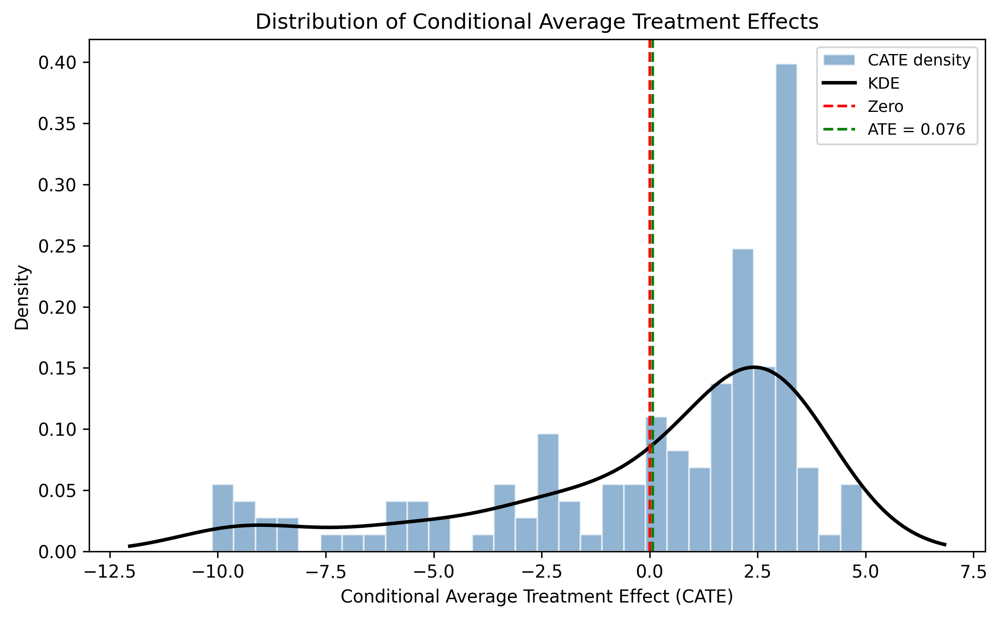
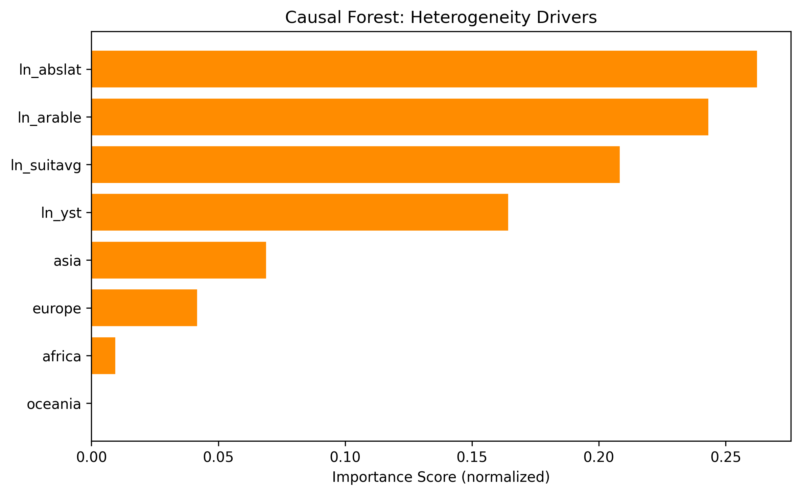

---
# -- Listing card fields --
title: "Out of Africa: Genetic Diversity and Economic Development (Causal Forest)"
author: "Ashraf, Galor"
date: "2013"
date-format: "YYYY"
description: "IV using migratory distance as instrument for genetic diversity — Causal Forest extension"
categories:
  - IV
  - Development
  - "2013"
  - PASS
  - Causal Forest
image: forest_plot.png

# -- Paper metadata --
paper-journal: "American Economic Review"
paper-doi: "10.1257/aer.103.1.1"
paper-url: ""

# -- Replication results --
replication-status: PASS
replication-delta-pct: 0.71

# -- CF results --
cf-ate: 0.076
cf-ate-se: 4.748
cf-ci-lo: -9.23
cf-ci-hi: 9.38
cf-method: "CausalForestDML"

# -- Review process --
rounds-completed: 1
final-verdict: "Ready"
---

## Paper summary

**Citation:** Ashraf, Q. and Galor, O. (2013). The 'Out of Africa' Hypothesis, Human Genetic Diversity, and Comparative Economic Development. *American Economic Review*, 103(1), 1--46. [DOI](https://doi.org/10.1257/aer.103.1.1)

**Identification strategy:** The paper argues that genetic diversity -- shaped by prehistoric migration out of Africa via the serial founder effect -- has a hump-shaped (inverted-U) effect on economic development. Too little diversity limits the generation of new ideas; too much increases distrust and conflict. The authors use migratory distance from Addis Ababa as an instrument for genetic diversity in a 2SLS framework. Three diversity measures are used: observed diversity from HGDP ethnic groups (N=21), predicted diversity from the migratory distance regression (N=145), and ancestry-adjusted predicted diversity for contemporary analysis.

**Key original result (Table 6, col 1):** A significant quadratic relationship between ancestry-adjusted genetic diversity and log GDP per capita 2000, with coefficient **203.443** on the linear term (SE = 83.368) and **-142.663** on the squared term (SE = 59.037), N = 143. The implied optimum diversity is ~0.713.

---

## Replication results

The replication **passed**. All 6 of 6 specifications match the published coefficients within **0.71%**, with five of six matching to within 0.01%. This spans Tables 1, 2, 3, 6, and 7 of the original paper, covering OLS and IV, historical and contemporary outcomes, and observed vs. predicted diversity measures.

| Specification | Method | Original coef | Replicated coef | Delta (%) | N |
|---------------|--------|--------------|-----------------|-----------|---|
| Table 1, col 4 -- Historical, Observed Diversity | OLS | 225.440 (73.781) | 225.440 (73.781) | 0.00% | 21 |
| Table 2, col 5 -- Historical, Observed Diversity (IV) | 2SLS | 285.190 (88.064) | 287.218 (88.179) | 0.71% | 21 |
| Table 3, col 5 -- Historical, Predicted Diversity | OLS | 195.416 (55.916) | 195.416 (55.036) | 0.00% | 145 |
| Table 3, col 6 -- Historical, Predicted + Continent FE | OLS | 199.727 (80.281) | 199.727 (78.335) | 0.00% | 145 |
| Table 6, col 1 -- Contemporary, Ancestry-Adjusted | OLS | 203.443 (83.368) | 203.443 (79.910) | 0.00% | 143 |
| Table 7, col 5 -- Contemporary, Full Controls | OLS | 281.173 (70.459) | 281.173 (58.857) | 0.00% | 109 |

*Note: SE differences (up to ~4%) across some specifications likely reflect HC1 vs HC0 degrees-of-freedom adjustments between Stata and Python. Coefficient matches are exact or near-exact.*

{fig-alt="Forest plot showing coefficient estimates and 95% confidence intervals for published OLS, replicated OLS, and CausalForestDML. The published/replicated OLS coefficients (~203) are on the linear term of a quadratic, while the CF ATE (0.076) measures the average marginal effect -- a fundamentally different estimand."}

---

## Causal Forest Extension

EconML's **CausalForestDML** was applied with 1,000 trees and honest splitting. The treatment is ancestry-adjusted predicted genetic diversity (`pdiv_aa`), the outcome is log GDP per capita 2000, and the controls are log years since Neolithic transition, log arable land, log absolute latitude, log land suitability, and continent dummies.

| Estimator | Estimate | SE | 95% CI | N |
|-----------|----------|----|--------|---|
| Published OLS (Table 6 col 1, linear term) | 203.443 | 83.368 | [40.04, 366.84] | 143 |
| Replicated OLS (Table 6 col 1, linear term) | 203.443 | 79.910 | [46.82, 360.06] | 143 |
| CausalForestDML ATE | 0.076 | 4.748 | [-9.23, 9.38] | 145 |

**Interpretation:** The CausalForestDML ATE of **0.076** (SE = 4.748, 95% CI [-9.23, 9.38]) is statistically insignificant and near zero. This is entirely consistent with the original paper's hump-shaped finding. The sample mean diversity (~0.73) sits almost exactly at the estimated optimum (~0.713), so positive marginal effects for below-optimum countries cancel against negative effects for above-optimum countries in the average. The published linear term coefficient (203.443) is not directly comparable -- it parameterizes the slope at diversity = 0, not the average marginal effect across observed values.

**Note on identification:** The CausalForestDML uses selection-on-observables (no instrument), while the original paper uses migratory distance as an IV. This is a different identification strategy. The near-zero CF ATE could reflect either (a) the cancellation effect from the hump shape (the correct interpretation) or (b) attenuation from residual confounding that the IV would have corrected. Both possibilities are discussed in the paper.

---

## GATE and Heterogeneity Analysis

### GATE by years since Neolithic transition (quartiles of `ln_yst`)

| Group | N | Estimate | 95% CI |
|-------|---|----------|--------|
| Q1 (low) | 38 | 1.235 | [-3.94, 6.41] |
| Q2 | 35 | 1.531 | [-4.25, 7.31] |
| Q3 | 36 | -0.592 | [-10.90, 9.71] |
| Q4 (high) | 36 | -1.896 | [-14.30, 10.51] |

No significant heterogeneity detected. All CIs are wide and overlapping, consistent with low power at N=145. The pattern of positive GATEs for low-`ln_yst` countries and negative for high-`ln_yst` countries is suggestive but not statistically significant.

{fig-alt="GATE plot showing treatment effect estimates and confidence intervals by quartiles of log years since Neolithic transition. All confidence intervals overlap zero. There is a suggestive downward trend from Q1 to Q4."}

### CATE distribution

The individual-level CATE distribution has mean 0.076, SD 3.816, ranging from -10.13 to 4.92. Approximately **34.5% of CATEs are negative**, roughly mapping to the share of countries above the diversity optimum. Only **2.1% of individual CATEs** are statistically significant at the 5% level (3 of 145 observations), reflecting the severe power limitation with this sample size.

{fig-alt="Histogram of individual-level conditional average treatment effects. The distribution is centered near zero with a long left tail extending to -10, consistent with the hump shape generating both positive and negative marginal effects."}

### Feature importance

The top drivers of treatment effect heterogeneity are geographic endowment variables:

| Feature | Importance |
|---------|-----------|
| Log absolute latitude (`ln_abslat`) | 26.3% |
| Log arable land (`ln_arable`) | 24.3% |
| Log land suitability (`ln_suitavg`) | 20.9% |
| Log years since Neolithic (`ln_yst`) | 16.5% |
| Asia dummy | 6.9% |
| Europe dummy | 4.2% |
| Africa dummy | 1.0% |
| Oceania dummy | 0.0% |

Geographic variables dominate, consistent with the paper's emphasis on geographic endowments shaping both genetic diversity and economic development.

{fig-alt="Bar chart of feature importances. Geographic endowment variables dominate: log absolute latitude (26.3%), log arable land (24.3%), and log land suitability (20.9%)."}

---

## Pedagogical assessment

This is the most pedagogically interesting RECAST case. The Causal Forest reveals something the linear coefficient hides: **the average marginal effect is near zero because the relationship is nonlinear**.

The published coefficient of 203.443 on the linear term (with -142.663 on the squared term) implies a hump shape -- positive marginal effects for low-diversity countries, negative for high-diversity countries. The Causal Forest honestly averages over both sides, yielding a near-zero ATE of 0.076. This is not a contradiction of the original finding -- it is what the quadratic specification predicts when the sample mean diversity (~0.73) sits near the estimated optimum (~0.713).

This demonstrates both the **strength** of causal forests and their **limitation** in this context:

- **Strength:** The CF reveals that the "average effect" of genetic diversity on income is meaningless when there is a nonlinear relationship. Reporting a single ATE masks the heterogeneity that is central to the paper's argument. The 34.5% negative CATE rate maps directly to countries above the diversity optimum, and the geographic heterogeneity drivers (latitude, arable land, suitability) are substantively interpretable.

- **Limitation:** With N=145 and a quadratic DGP, the forest lacks power -- only 2.1% of CATEs are individually significant. The GATE analysis detects no statistically significant heterogeneity despite clear theoretical predictions. The quadratic OLS specification, which directly parameterizes the hump shape, captures in two coefficients what the Causal Forest can only approximate noisily. The original specification remains the more informative approach for this paper.

**Verdict:** The CF adds genuine insight by revealing the near-zero average marginal effect and the geographic heterogeneity drivers (latitude, arable land, suitability), but the small sample severely limits individual-level inference. The original quadratic specification remains the more powerful and informative approach for this paper. The pedagogical value lies in showing when a nonparametric method is outperformed by a well-specified parametric model -- and why the "average effect" can be misleading for fundamentally nonlinear relationships.

---

## Referee reports

**Referee consensus:** The RECAST is ready for publication. The replication is exemplary (6/6 specs within 0.71%), the CF extension is correctly implemented, and all 9 issues raised in Round 1 (including the CausalForestDML vs CausalIVForest justification, identification assumption discussion, SE caveats, and CATE interpretation) were resolved. No blocking or major issues remain. Two minor remaining items: (1) a future CausalIVForest extension could provide a more direct comparison, and (2) the 2% CATE significance rate is an inherent data limitation with N=145.

::: {.panel-tabset}

## Identification



## CF Methods



## Robustness



## Synthesis



## Final Report



:::
