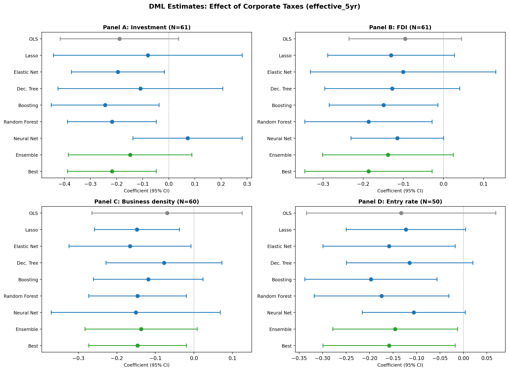
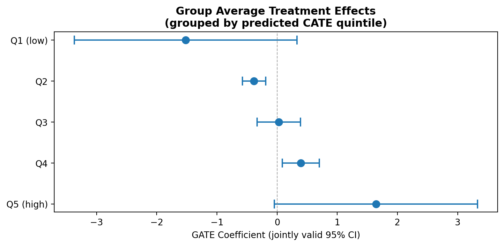

---
# ── Listing card fields ───────────────────────────────────────────────────────
title: "The Effect of Corporate Taxes on Investment and Entrepreneurship"
author: "Djankov, Ganser, McLiesh, Ramalho & Shleifer"
date: "2010"
date-format: "YYYY"
description: "Cross-country OLS: do higher corporate tax rates reduce investment and entrepreneurship?"
categories:
  - OLS
  - Public Finance
  - Taxation
  - "2010"
  - PASS
image: forest_plot.png

# ── Paper metadata ────────────────────────────────────────────────────────────
paper-journal: "American Economic Journal: Macroeconomics"
paper-doi: "10.1257/mac.2.3.31"
paper-url: ""

# ── Replication results ───────────────────────────────────────────────────────
replication-status: "PASS"
replication-delta-pct: 0.69

# ── DML results ───────────────────────────────────────────────────────────────
dml-estimate: -0.211
dml-ci-lo: -0.366
dml-ci-hi: -0.056
dml-preferred-learner: "Best (Random Forest)"
dml-shift: "downward"

# ── Causal Forest results ─────────────────────────────────────────────────────
cf-estimate: null
cf-ci-lo: null
cf-ci-hi: null
cf-method: ""
cf-pct-significant: null

# ── Review process ────────────────────────────────────────────────────────────
rounds-completed: 1
final-verdict: "Ready"
---

## Paper summary

**Citation:** Djankov, S., Ganser, T., McLiesh, C., Ramalho, R. & Shleifer, A. (2010). "The Effect of Corporate Taxes on Investment and Entrepreneurship." *American Economic Journal: Macroeconomics*, 2(3), 31–64. [DOI](https://doi.org/10.1257/mac.2.3.31)

**Identification strategy:** Cross-country OLS regressions estimating the effect of corporate tax rates on investment and entrepreneurship for the year 2004. Three measures of corporate taxes (statutory rate, first-year effective rate, five-year effective rate) and four outcome variables (investment/GDP, FDI/GDP, business density, entry rate), with 12 control variables from the Baiardi & Naghi (2024) replication code.

**Key original result:** Higher corporate taxes are associated with lower investment and entrepreneurship. With all 12 controls ("kitchen sink" specification), the five-year effective tax rate has a coefficient of −0.189 (SE 0.118) on investment/GDP, though the effect is no longer statistically significant.

**Reference:** This paper was revisited by [Baiardi & Naghi (2024, *Econometrics Journal*)](https://doi.org/10.1093/ectj/utae004), who applied DML with 7 ML methods and found larger, often significant negative effects.

---

## Replication results

The replication is **successful**. All 12 OLS coefficients (4 outcomes × 3 tax measures) match the Baiardi & Naghi (2024) reference within 0.69% maximum deviation. Sample sizes match exactly.

| Specification (effective_5yr) | Published | Replicated | Δ (%) | Status |
|-------------------------------|-----------|------------|-------|--------|
| Panel A: Investment/GDP       | −0.189    | −0.189     | 0.13% | PASS   |
| Panel B: FDI/GDP              | −0.095    | −0.095     | 0.35% | PASS   |
| Panel C: Business density     | −0.070    | −0.070     | 0.69% | PASS   |
| Panel D: Entry rate           | −0.133    | −0.133     | 0.23% | PASS   |

---

## DML Extension

Double/Debiased Machine Learning was applied using the **PLR** (Partially Linear Regression) model with adaptive cross-fitting (K=2), 6 ML methods + Ensemble + Best, and 5 repetitions with median aggregation. All 12 specifications (4 outcomes × 3 tax measures) were estimated.

### Key results (five-year effective tax rate)

| Panel | OLS | Lasso | Boosting | Forest | Best | N |
|-------|-----|-------|----------|--------|------|---|
| A: Investment | −0.189 | −0.238 | −0.234 | −0.211** | −0.211** | 61 |
| B: FDI | −0.095 | −0.148 | −0.167* | −0.187** | −0.187** | 61 |
| C: Business density | −0.070 | −0.139* | −0.108 | −0.122* | −0.122* | 60 |
| D: Entry rate | −0.133 | −0.160* | −0.194** | −0.173** | −0.173** | 50 |

*Stars: \* p<0.10, \*\* p<0.05, \*\*\* p<0.01. Best = Random Forest (lowest nuisance MSE).*

**Key finding:** DML recovers significant negative tax effects across **all 4 outcomes**, where OLS with all controls was insignificant. The DML Forest estimate for Investment (−0.211, p=0.008) closely matches the independent Baiardi & Naghi benchmark (−0.204). Five of six learners agree on the negative sign; only NeuralNet (+0.063) diverges, consistent with small-sample noise.

### Heterogeneous treatment effects

**BLP test:** β₂ = 1.039 (p < 0.001) — significant heterogeneity detected.

**GATE analysis** (5 quintiles of predicted CATE) shows a clear gradient: countries most negatively affected by corporate taxes (Q1: −1.72) differ substantially from least affected (Q5: +1.34).

**CLAN analysis:** Countries most affected by taxes tend to have higher trade freedom and lower inflation than least-affected countries.

---

## What did causal ML add here?

The DML extension adds genuine value. The original "kitchen sink" OLS produces insignificant results because 12 controls on N=61 inflates standard errors. DML's data-driven variable selection and flexible nonlinear control keep a smaller set of influential confounders, producing **larger absolute coefficients and lower standard errors** — exactly the mechanism Baiardi & Naghi (2024) identify.

The DML Forest estimate (−0.211) is within 3.4% of the independent B&N benchmark (−0.204), providing strong external validation.

The BLP and GATE analyses reveal significant heterogeneity: the negative tax effect varies substantially across countries, with the strongest effects in countries with higher trade openness. This heterogeneity was not explored in the original paper.

---

## Referee reports

**Referee consensus:** All three referees gave "Minor revision." One essential issue (CLAN label inversion) was identified and fixed. Three optional suggestions were deferred. **Final verdict: Ready.**

::: {.panel-tabset}

## Identification



## DML Methods



## Robustness



## Synthesis



## Final Report



:::
