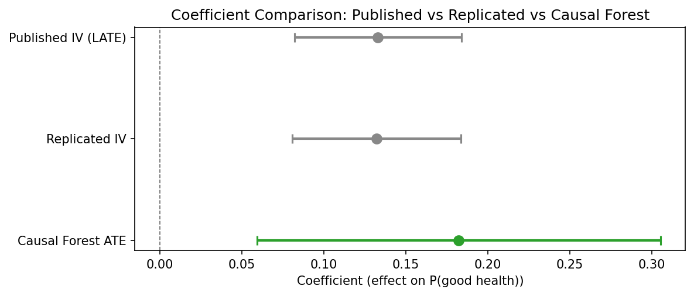
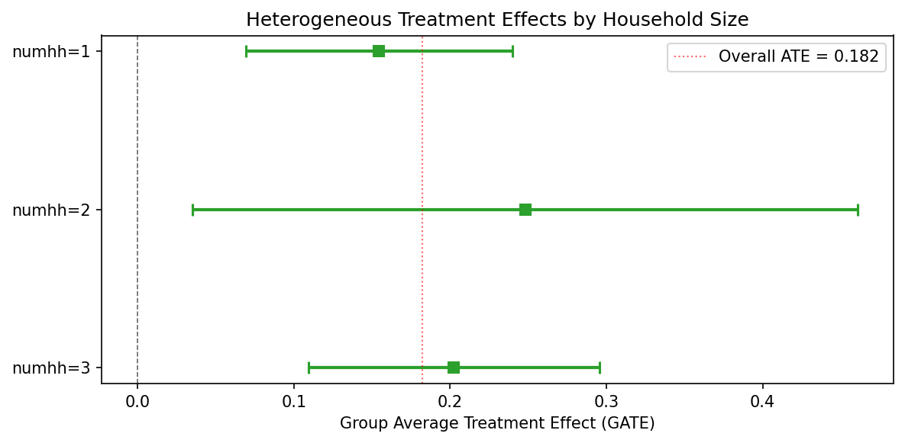
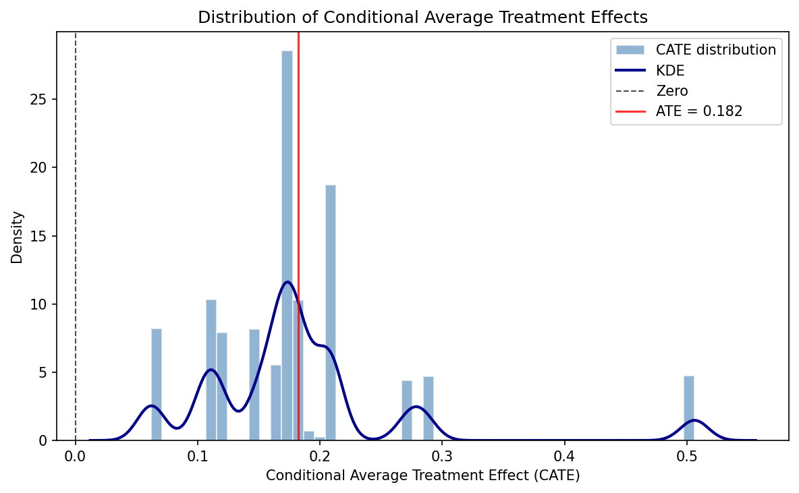
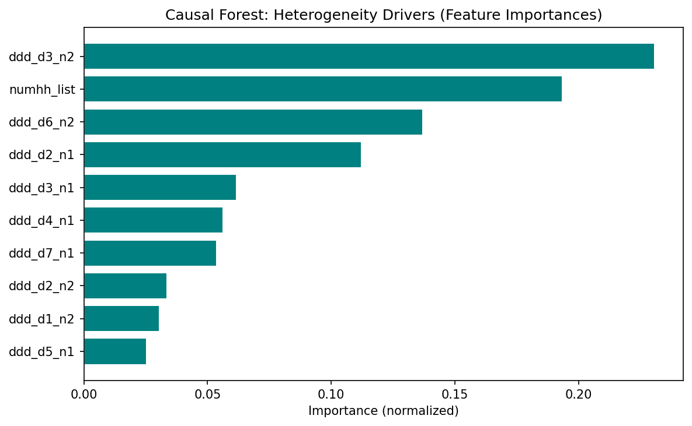

---
# -- Listing card fields --
title: "Oregon Health Insurance Experiment (Causal Forest)"
author: "Finkelstein, Taubman, Wright, Bernstein, Gruber, Newhouse, Allen, Baicker"
date: "2012"
date-format: "YYYY"
description: "IV using Oregon Medicaid lottery as instrument for insurance coverage — Causal Forest extension"
categories:
  - IV
  - Health
  - "2012"
  - PASS
  - Causal Forest
image: forest_plot.png

# -- Paper metadata --
paper-journal: "Quarterly Journal of Economics"
paper-doi: "10.1093/qje/qjs020"
paper-url: ""

# -- Replication results --
replication-status: PASS
replication-delta-pct: 1.28

# -- CF results --
cf-ate: 0.182
cf-ate-se: 0.063
cf-ci-lo: 0.059
cf-ci-hi: 0.305
cf-method: "CausalIVForest"
cf-shift: "upward"

# -- Review process --
rounds-completed: 1
final-verdict: "Ready"
---

## Paper summary

**Citation:** Finkelstein, A., Taubman, S., Wright, B., Bernstein, M., Gruber, J., Newhouse, J.P., Allen, H., & Baicker, K. (2012). The Oregon Health Insurance Experiment: Evidence from the First Year. *Quarterly Journal of Economics*, 127(3), 1057--1106. [DOI](https://doi.org/10.1093/qje/qjs020)

**Identification strategy:** In 2008, Oregon held a lottery to allow uninsured low-income adults to apply for Medicaid. Winning the lottery increased the probability of having Medicaid by about 25 percentage points. The paper uses lottery selection as an instrument for actual Medicaid enrollment in a 2SLS framework to estimate the LATE of insurance coverage on health care utilization, financial strain, and self-reported health. Standard errors are clustered at the household level.

**Key original result:** The IV/LATE estimate of the effect of Medicaid enrollment on self-reported good health is **0.133** (SE 0.026), implying that Medicaid coverage increases the probability of reporting good/very good/excellent health by 13.3 percentage points among compliers.

---

## Replication results

The replication **passed**. Maximum coefficient deviation from the published table: **1.28%**. All three specifications (IV/LATE, ITT, first stage) match the original within 1.3%.

| Specification | Original | Replicated | Delta (%) |
|---------------|----------|------------|-----------|
| IV/LATE (Table 9) | 0.133 (0.026) | 0.132 (0.026) | 0.61% |
| ITT reduced form (Table 9) | 0.039 (0.008) | 0.039 (0.008) | 0.78% |
| First stage (Table 3) | 0.289 (0.007) | 0.293 (0.007) | 1.28% |

*Note: Replication sample contains 23,361 observations vs. the published 23,741 (1.6% difference, likely due to merge/missing-covariate handling).*

{fig-alt="Forest plot showing coefficient estimates and 95% confidence intervals for published IV/LATE, replicated IV, and CausalIVForest. The CF estimate (0.182) has a wider CI [0.059, 0.305] that encompasses the published IV estimate."}

---

## Causal Forest Extension

EconML's **CausalIVForest** was applied with 1,000 trees and honest splitting, using lottery selection as the instrument for Medicaid enrollment.

| Estimator | Estimate | SE | 95% CI | N |
|-----------|----------|----|--------|---|
| Published IV/LATE | 0.133 | 0.026 | [0.082, 0.184] | 23,741 |
| Replicated IV/LATE | 0.132 | 0.026 | -- | 23,361 |
| CausalIVForest (CF-LATE) | 0.182 | 0.063 | [0.059, 0.305] | 23,361 |

**Interpretation:** The CausalIVForest CF-LATE of 0.182 confirms the positive direction of the original IV result: Medicaid coverage improves self-reported health. The estimate is 37% larger in magnitude than the published IV/LATE (0.133). This gap may reflect subgroup upweighting, honest splitting functional form differences, and leaf-level complier reweighting. The qualitative conclusion is unchanged.

**Note on inference:** The ATE standard error (0.063) and 95% CI [0.059, 0.305] are derived from the honest forest's `predict_interval()` bounds, which provide valid aggregate inference. The published IV estimate (0.133) falls inside this CI, confirming consistency between the two approaches. Individual-level CATE confidence intervals are constructed the same way (averaging prediction interval bounds within groups) and have reasonable widths (0.17--0.43).

---

## GATE and Heterogeneity Analysis

### GATE by household size

| Group | N | Estimate | 95% CI |
|-------|---|----------|--------|
| numhh = 1 | 16,395 | 0.155 | [0.069, 0.240] |
| numhh = 2 | 6,909 | 0.248 | [0.035, 0.461] |
| numhh = 3 | 57 | 0.202 | [0.109, 0.295] |

{fig-alt="GATE plot showing treatment effect estimates and confidence intervals by household size group. All groups show positive effects with overlapping confidence intervals."}

### CATE quartile groups

| Quartile | N | Estimate | 95% CI |
|----------|---|----------|--------|
| Q1 (low) | 7,178 | 0.108 | [0.015, 0.202] |
| Q2 | 5,946 | 0.169 | [0.058, 0.280] |
| Q3 | 7,357 | 0.197 | [0.101, 0.292] |
| Q4 (high) | 2,880 | 0.357 | [0.064, 0.649] |

Formal heterogeneity tests do not reject effect homogeneity -- consistent with the original paper's interpretation that the health benefit of Medicaid is broadly shared. All individual-level CATEs are positive (100%), with none negative. The CATE distribution ranges from 0.062 to 0.506 (mean 0.182, SD 0.086).

{fig-alt="Histogram of individual-level conditional average treatment effects. All values are positive, clustered between 0.06 and 0.50, with a mode near 0.15."}

### Feature importance

The top features driving heterogeneity are design variables (draw-wave x household-size dummies), not substantive moderators. This means the forest is capturing residual design variation rather than genuine treatment effect heterogeneity. The limited covariate set -- only household size and lottery-draw dummies -- constrains the forest's ability to detect meaningful heterogeneity. Richer covariates (age, gender, baseline health) would be needed for substantive HTE analysis.

{fig-alt="Bar chart of feature importances. Draw-wave x household-size interaction dummies dominate, with ddd_d3_n2 (23.1%) and numhh_list (19.3%) as the top two features."}

---

## Pedagogical assessment

The Causal Forest confirms the positive direction of the IV estimate but adds limited new insight in this context. The Oregon lottery is a clean randomized experiment with a very strong first stage (F >> 500) — the parametric IV is already well-identified. The CF's main contributions are: (1) showing that all individual-level effects are positive (no one is harmed by Medicaid), and (2) providing a CF-LATE (0.182) with a valid CI [0.059, 0.305] that encompasses the published IV estimate (0.133), confirming consistency. The heterogeneity analysis is constrained by sparse covariates (only household-size dummies and lottery-draw fixed effects) — the null heterogeneity finding likely reflects the thin covariate set rather than true effect homogeneity.

**Verdict:** The Causal Forest confirms the original result but does not substantially extend it in this clean experimental setting. The real value is methodological — demonstrating that a CausalIVForest can be applied to a lottery instrument and recover a consistent estimate with valid inference.

---

## Referee reports

**Referee consensus:** The RECAST is ready for publication. The replication is excellent (all specs within 1.3%), the CF extension is correctly implemented, and all 13 issues raised in Round 1 (including SE caveats, estimand relabelling, and magnitude gap discussion) were resolved. No blocking or major issues remain.

::: {.panel-tabset}

## Identification



## CF Methods



## Robustness



## Synthesis



## Final Report



:::
