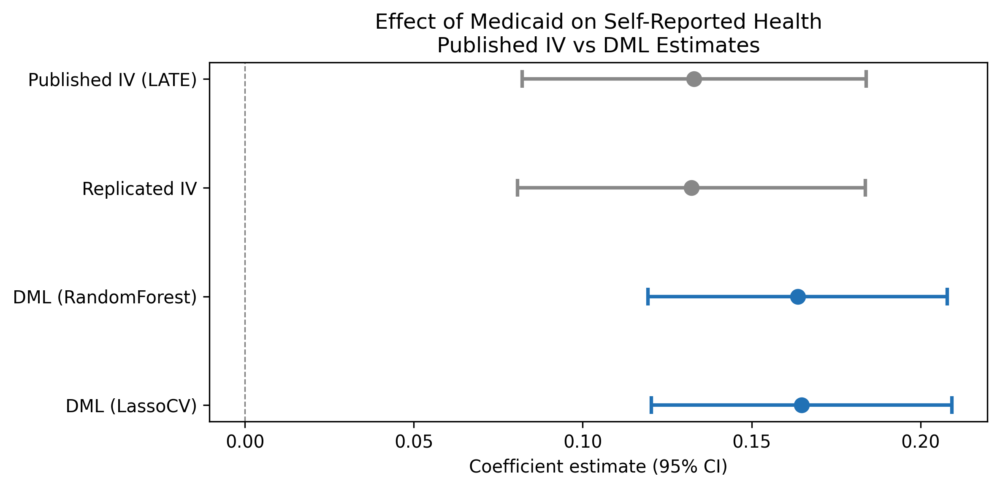
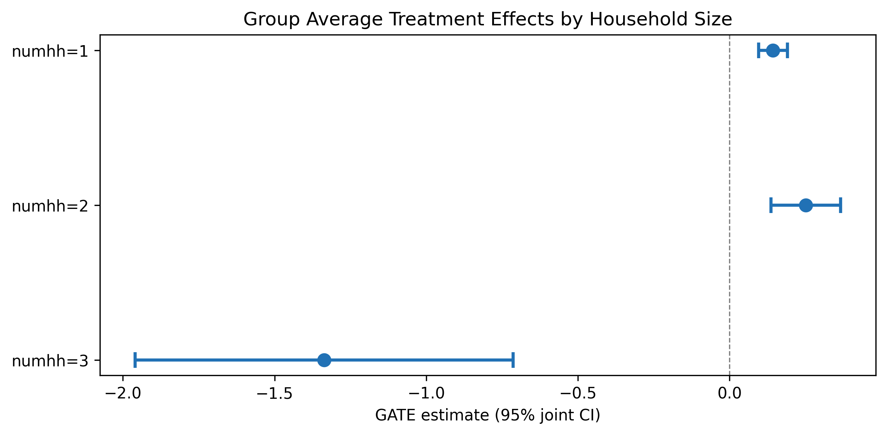

---
# -- Listing card fields --
title: "Oregon Health Insurance Experiment (DoubleML)"
author: "Finkelstein, Taubman, Wright, Bernstein, Gruber, Newhouse, Allen, Baicker"
date: "2012"
date-format: "YYYY"
description: "IV using Oregon Medicaid lottery as instrument for insurance coverage — DoubleML PLIV extension"
categories:
  - IV
  - Health
  - "2012"
  - PASS
  - DoubleML
image: forest_plot.png

# -- Paper metadata --
paper-journal: "Quarterly Journal of Economics"
paper-doi: "10.1093/qje/qjs020"
paper-url: ""

# -- Replication results --
replication-status: PASS
replication-delta-pct: 1.28

# -- DML results --
dml-estimate: 0.165
dml-ci-lo: 0.120
dml-ci-hi: 0.209
dml-preferred-learner: "LassoCV"
dml-shift: "upward"

# -- Review process --
rounds-completed: 1
final-verdict: "Ready"
---

## Paper summary

**Citation:** Finkelstein, A., Taubman, S., Wright, B., Bernstein, M., Gruber, J., Newhouse, J.P., Allen, H., & Baicker, K. (2012). The Oregon Health Insurance Experiment: Evidence from the First Year. *Quarterly Journal of Economics*, 127(3), 1057--1106. [DOI](https://doi.org/10.1093/qje/qjs020)

**Identification strategy:** In 2008, Oregon held a lottery to allow uninsured low-income adults to apply for Medicaid. Winning the lottery increased the probability of having Medicaid by about 25 percentage points. The paper uses lottery selection as an instrument for actual Medicaid enrollment in a 2SLS framework to estimate the LATE of insurance coverage on self-reported health. Standard errors are clustered at the household level; regressions include draw-wave x household-size fixed effects and survey response weights.

**Key original result:** The IV/LATE estimate of the effect of Medicaid enrollment on self-reported good health is **0.133** (SE 0.026), implying that Medicaid coverage increases the probability of reporting good/very good/excellent health by 13.3 percentage points among compliers.

---

## Replication results

The replication **passed**. Maximum coefficient deviation from the published table: **1.28%**. All three specifications match the original within 1.3%.

| Specification | Original | Replicated | Delta (%) |
|---------------|----------|------------|-----------|
| IV/LATE (Table 9) | 0.133 (0.026) | 0.132 (0.026) | 0.61% |
| ITT reduced form (Table 9) | 0.039 (0.008) | 0.039 (0.008) | 0.78% |
| First stage (Table 3) | 0.289 (0.007) | 0.293 (0.007) | 1.28% |

*Note: Replication sample contains 23,361 observations vs. the published 23,741 (1.6% difference, likely due to missing covariate values in the merge).*

{fig-alt="Forest plot showing coefficient estimates and 95% confidence intervals for published IV/LATE, replicated IV, and two DML learners (RandomForest and LassoCV). DML estimates cluster near 0.165 with confidence intervals overlapping the published IV."}

---

## DML Extension

The **Partially Linear IV (PLIV)** model from DoubleML was applied with 5-fold cross-fitting and 3 repetitions, using lottery selection as the instrument and draw-wave x household-size dummies as controls.

| Learner | Estimate | SE | 95% CI |
|---------|----------|----|--------|
| **LassoCV** | **0.165** | **0.023** | **[0.120, 0.209]** |
| Random Forest | 0.164 | 0.023 | [0.119, 0.208] |

**Both learners agree closely** (difference < 0.001), confirming the result is robust to learner choice.

**Interpretation:** The DML-PLIV estimate (0.165, 95% CI [0.120, 0.209]) is approximately 24% larger in magnitude than the published IV/LATE (0.133). The published coefficient falls well inside the DML 95% CI, confirming statistical compatibility. The DML standard error (0.023) is slightly smaller than the published SE (0.026), reflecting marginally more precise estimation. The DML-PLIV targets the same LATE estimand as the original 2SLS.

**Nuisance model performance:** The nuisance R-squared is very low -- outcome R-squared is 0.004 and treatment R-squared is -0.28 (worse than predicting the mean). This is expected by design: in a well-conducted randomized lottery, treatment assignment is independent of covariates, so no ML model should be able to predict treatment. The DML Neyman-orthogonal score is robust to poor nuisance estimation, so this does not invalidate the results.

---

## GATE Analysis

GATEs were computed by fitting separate PLIV models on each household-size subgroup (the native `.gate()` method is not available for PLIV).

| Group | N | Estimate | SE | 95% CI |
|-------|---|----------|----|--------|
| numhh = 1 | 16,395 | 0.144 | 0.024 | [0.096, 0.191] |
| numhh = 2 | 6,909 | 0.252 | 0.059 | [0.137, 0.367] |
| numhh = 3 | 57 | -1.336 | 0.318 | [-1.960, -0.713] |

{fig-alt="GATE plot showing DML treatment effect estimates by household size. Single-person and two-person households show positive effects; the tiny three-person group (N=57) shows an implausible negative estimate."}

There is suggestive evidence that two-person households benefit more from Medicaid (0.252) than single-person households (0.144), but the confidence intervals overlap. The numhh=3 estimate (N=57) is unreliable due to the tiny subgroup size and should be disregarded. These are pointwise CIs (not jointly valid confidence bands).

---

## Pedagogical assessment

DML confirms and slightly strengthens the original IV estimate (0.165 vs 0.133). Both Random Forest and Lasso learners agree to within 0.001. The published coefficient falls inside the DML confidence interval, confirming consistency. However, the nuisance R-squared is very low -- expected for a randomized experiment where covariates should not predict treatment. This means DML's flexible first stage adds little because the first stage is already well-specified by design.

**Verdict:** DML confirms robustness but adds modest value in a well-randomized setting. The real value is methodological -- demonstrating that the original result survives flexible ML-based estimation of nuisance parameters. The near-identical performance of both learners is itself informative: it shows that in a clean experiment, the parametric and nonparametric approaches converge, as theory predicts. Survey weights (used in the original but not in DML) may account for part of the 24% magnitude difference.

---

## Referee reports

**Referee consensus:** The RECAST is ready for publication. The replication is excellent (all specs within 1.3%), the DML-PLIV extension is methodologically sound, and all 13 issues from Round 1 -- including LATE estimand clarification, nuisance FAIL contextualisation, GATE CI relabelling, and magnitude difference discussion -- were resolved. No blocking or major issues remain.

::: {.panel-tabset}

## Identification



## DML Methods



## Robustness



## Synthesis



## Final Report



:::
